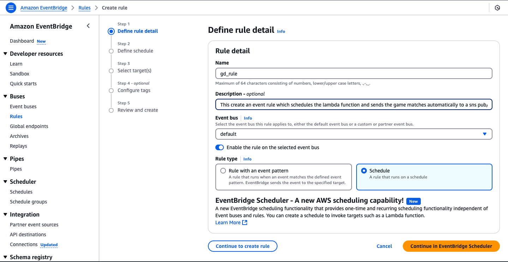

# NBA Game Day Notifications / Sports Alerts System

## **Project Overview**
This project is an alert system that sends real-time NBA game day score notifications to subscribed users via SMS/Email. It leverages **Amazon SNS**, **AWS Lambda and Python**, **Amazon EventBridge**, and **NBA APIs** to provide sports fans with up-to-date game information. The project demonstrates cloud computing principles and efficient notification mechanisms.

---

## **Features**
- Fetches live NBA game scores using an external API.
- Sends formatted score updates to subscribers via SMS/Email using Amazon SNS.
- Scheduled automation for regular updates using Amazon EventBridge.
- Designed with security in mind, following the principle of least privilege for IAM roles.

---

## **Prerequisites**
- Free account with subscription and API Key at [SportsData.io](https://sportsdata.io/)
- Personal AWS account with a basic understanding of AWS and Python.

---

## **Technical Architecture**


---

## **Technologies**
- **Cloud Provider**: AWS
- **Core Services**: SNS, Lambda, EventBridge
- **External API**: NBA Game API (SportsData.io)
- **Programming Language**: Python 3.x
- **IAM Security**: Least privilege policies for Lambda, SNS, and EventBridge.

---

## **Project Structure**
```bash
project-folder/
├── src/
│   ├── gd_notifications.py          # Main Lambda function code
├── policies/
│   ├── sns_policy.json              # SNS publishing permissions
│   ├── eventbridge_policy.json      # EventBridge to Lambda permissions
│   └── lambda_policy.json           # Lambda execution role permissions
├── images/                          # Image assets for documentation
│   ├── architecture_diagram.png
│   ├── sns_topic_setup.png
│   ├── subscription_setup.png
│   ├── iam_policy.png
│   ├── lambda_deployment.png
│   └── eventbridge_setup.png
├── .gitignore
└── README.md                        # Project documentation
```

---

## **Setup Instructions**

### **1. Clone the Repository**
```bash
git clone https://github.com/Stormz99/game-day-notifications.git
cd game-day-notifications
```

### **2. Create an SNS Topic**
1. Open the AWS Management Console.
2. Navigate to the SNS service.
3. Click **Create Topic** and select **Standard** as the topic type.
4. Name the topic (e.g., `gd_topic`) and note the ARN.
5. Click **Create Topic**.


### **3. Add Subscriptions to the SNS Topic**
1. Open the topic from the list.
2. Navigate to the **Subscriptions** tab and click **Create subscription**.
3. Select a protocol:
   - **Email**: Enter a valid email address.
   - **SMS**: Enter a valid phone number in international format (e.g., +1234567890).
4. Click **Create Subscription**.
5. For email subscriptions, confirm the subscription via the email link sent to your inbox.


### **4. Create an SNS Publish Policy**
1. Open the IAM service in the AWS Management Console.
2. Navigate to **Policies** → **Create Policy**.
3. Click **JSON** and paste the contents of `sns_policy.json`.
4. Replace `REGION` and `ACCOUNT_ID` with your AWS region and account ID.
5. Click **Next: Tags** (optional), then **Next: Review**.
6. Name the policy (e.g., `gd_sns_policy`) and click **Create Policy**.


### **5. Create an IAM Role for Lambda**
1. Open the IAM service in the AWS Management Console.
2. Click **Roles** → **Create Role**.
3. Select **AWS Service** and choose **Lambda**.
4. Attach the following policies:
   - `gd_sns_policy` (created earlier).
   - **AWSLambdaBasicExecutionRole** (AWS managed policy).


5. Name the role (e.g., `gd_role`) and click **Create Role**.

!  [iam_role](./images/iam_role.png)

### **6. Deploy the Lambda Function**
1. Open the Lambda service in the AWS Management Console.
2. Click **Create Function**.
3. Select **Author from Scratch** and provide the following details:
   - **Function Name**: `gd_notifications`
   - **Runtime**: Python 3.x
   - **Execution Role**: Use the ARN of the `gd_role` created earlier.
4. Under the Function Code section:
   - Upload or paste the code from `src/gd_notifications.py`.
5. Add the following environment variables:
   - `NBA_API_KEY`: Your NBA API key.
   - `SNS_TOPIC_ARN`: ARN of the SNS topic created earlier.
6. Click **Create Function**.


### **7. Automate with EventBridge**
1. Open the EventBridge service in the AWS Management Console.
2. Navigate to **Rules** → **Create Rule**.
3. Select **Event Source**: Schedule.
4. Define the cron schedule for updates (e.g., hourly).
5. Add a target:
   - **Target Type**: Lambda Function
   - **Function Name**: `gd_notifications`
6. Save the rule.



---

## **Testing the System**
1. Open the Lambda function in the AWS Management Console.
2. Create a test event to simulate execution.
3. Run the function and check CloudWatch logs for errors.
4. Verify that SMS or email notifications are sent to the subscribed users.


---

## **What We Learned**
1. Designing a notification system with AWS SNS and Lambda.
2. Securing AWS services with least privilege IAM policies.
3. Automating workflows using EventBridge.
4. Integrating external APIs into cloud-based workflows.

